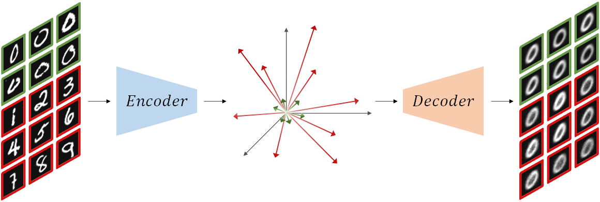

# Targeted collapse regularized autoencoder for anomaly detection: black hole at the center

---

This code provides a PyTorch implementation for **Toll** (**T**argeted c**oll**apse) regularized autoencoder, as described in the paper [Targeted collapse regularized autoencoder for anomaly detection: black hole at the center](https://arxiv.org/abs/2306.12627).



Toll is a principled and strikingly straightforward method that markedly improves the anomaly detection performance of autoencoders.
Unlike many alternative approaches that rely on additional neural network components, involved computations, and cumbersome training, Toll improves the performance simply by complementing the reconstruction loss with a computationally light term that regulates the norm of representations in the latent space.
The simplicity of our approach minimizes the requirement for hyperparameter tuning and customization for new applications which, paired with its relaxed data modality requirements, enhances the potential for successful adoption across a broad range of applications.
Notably, implementing the targeted collapse in the context of state-of-the-art methods, even ones not based on autoencoders, can further improve their performance (see paper for demonstrations).

## Citation

If you find this repository useful, please cite our paper:

```bibtex
@ARTICLE{
  author={Amin Ghafourian, Huanyi Shui, Devesh Upadhyay, Rajesh Gupta, Dimitar Filev and Iman Soltani},
  title={Targeted collapse regularized autoencoder for anomaly detection: black hole at the center},
  journal={IEEE Transactions on Neural Networks and Learning Systems},
  year={2024},
  volume={},
  number={},
  pages={},
  doi={}}
```
## Evironment Setup

### Create and activate virtual environment
```bash
python -m venv toll
source toll/bin/activate
```

### Install dependencies
```bash
pip install -r requirements.txt
```

## Datasets

**MNIST**: Download from [here](https://yann.lecun.com/exdb/mnist/) or [here](https://www.kaggle.com/datasets/hojjatk/mnist-dataset).

**Fashion-MNIST**: Download from [here](https://github.com/zalandoresearch/fashion-mnist).

**CIFAR-10** and **CIFAR-100**: Download from [here](https://www.cs.toronto.edu/~kriz/cifar.html).

**Arrhythmia**: Download from [here](https://odds.cs.stonybrook.edu/arrhythmia-dataset/).

## Training and Evaluation

Run each line below for training and evaluation of the corresponding dataset. ```--mode``` is set to ```train``` by default.
This setting will also evaluate the trained models.
By default, each experiment is repeated 10 times with different weight initializations.
This can be customized by setting the ```--num_seeds``` flag to the desired number of repetitions.
See [main.py](main.py) for additional parameters and descriptions.

```bash
python main.py --dataset mnist --dataset_path <path/to/mnist/files> --num_classes 10 --batch_size 1000 --beta 1000 --z_dim 128 --lr 0.0001
python main.py --dataset fmnist --dataset_path <path/to/fmnist/files> --num_classes 10 --batch_size 500 --beta 100 --z_dim 256 --lr 0.0001
python main.py --dataset cifar10 --dataset_path <path/to/cifar10/files> --num_classes 10 --batch_size 50 --beta 10 --z_dim 64 --lr 0.01
python main.py --dataset cifar100 --dataset_path <path/to/cifar100/files> --num_classes 20 --batch_size 100 --beta 100 --z_dim 64 --lr 0.001
python main.py --dataset arrhythmia --dataset_path <path/to/arrhythmia/file> --num_classes 1 --batch_size 100 --beta 10 --z_dim 16 --lr 0.001
```

---
